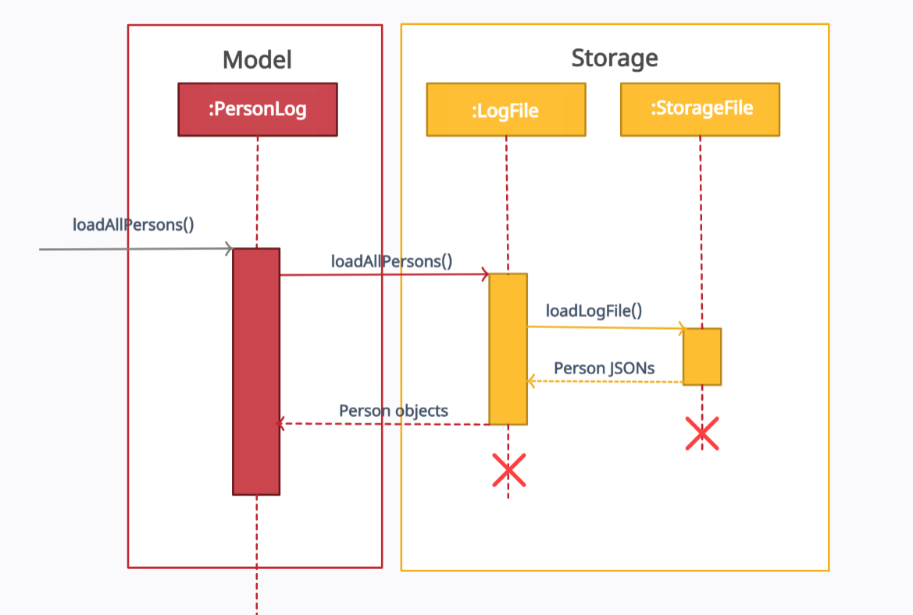

# Control Your Crowd - Developer Guide

* [1. Setting up](DeveloperGuide.md#1-setting-up)
* [2. Design](DeveloperGuide.md#2-design)
    * [2.1 Architecture](DeveloperGuide.md#21-architecture)
    * [2.2 UI component](DeveloperGuide.md#22-ui-component)
    * [2.3 Logic component](DeveloperGuide.md#23-logic-component)
    * [2.4 Model component](DeveloperGuide.md#24-model-component)
    * [2.5 Storage component](DeveloperGuide.md#25-storage-component)
    * [2.6 Common classes](DeveloperGuide.md#26-common-classes)
* [3. Implementation](DeveloperGuide.md#3-implementation)
* [4. Documentation](DeveloperGuide.md#4-documentation)
* [5. Testing](DeveloperGuide.md#5-testing)
* [6. Dev Ops](DeveloperGuide.md#6-dev-ops)
* [Appendix](DeveloperGuide.md#appendix)
    * [Appendix A: Product Scope](DeveloperGuide.md#appendix-a-product-scope)
        * [Target user profile](DeveloperGuide.md#target-user-profile)
        * [Value proposition](DeveloperGuide.md#value-proposition)
    * [Appendix B: User Stories](DeveloperGuide.md#appendix-b-user-stories)
    * [Appendix C: Non Functional Requirements](DeveloperGuide.md#appendix-d-non-functional-requirements)
    * [Appendix D: Glossary](DeveloperGuide.md#appendix-e-glossary)
    * [Appendix E: Instructions for Manual Testing](DeveloperGuide.md#appendix-f-instructions-for-manual-testing)
        * [Launching CYC](DeveloperGuide.md#launching-cyc)
        * [Check in a visitor](DeveloperGuide.md#check-in-a-visitor)
        * [Check out a visitor](DeveloperGuide.md#check-out-a-visitor)  
        * [Clearing all visitors](DeveloperGuide.md#clearing-all-visitor)
        * [Editing maximum capacity](DeveloperGuide.md#editing-maximum-capacity)
        * [Finding a visitor](DeveloperGuide.md#finding-a-visitor)
        * [Help](DeveloperGuide.md#help)
        * [Listing checked in visitors](DeveloperGuide.md#listing-checked-in-visitors)
        * [Listing all visitors](DeveloperGuide.md#listing-all-visitors)
        * [Moving storage location](DeveloperGuide.md#moving-storage-location)
        * [Exiting CYC](DeveloperGuide.md#exiting-cyc)

## 1. Setting up

The instructions for setting up can be [found here](SettingUp.md).

## 2. Design

### 2.1 Architecture

*Figure 1. Architecture Diagram*

The ***Architecture Diagram*** shown above explains the high-level design of Control Your Crowd (CYC) application.
Below is a quick overview of each component.

`Main` is a class that is critical to starting the application proper, as well as exiting it:
* At app launch: Retrieves memory and saved log files (If available), initializes components in correct sequence,
  and connects them with each other.

* At shut down: It saves the log file to storage, and shuts down all components.

`Common` consists of a class of messages used by multiple components.
* `Messages` consists of a list of messages that will be displayed to the users, for various reasons such as error handling
  and user notification.

The rest of Control-Your-Crowd (CYC) consist of four components.
* `UI`: The user interface of the application, and the entry point from the user.

* `Logic`: The command executor for CYC.

* `Model` : Holds the in-App data, such as the details of the user, and their checked-in/checked-out status.

* `Storage`: Reads and writes data from the hard disk to CYC.

#### How the architecture components interact with each other

The *Sequence Diagram* below shows how the components interact with each other for the scenario where the user issues
the command `clear`.

*Figure 2. Component interactions for `clear` command*

### 2.2 UI component

*Figure 3. Structure of UI component*

**API** : [`seedu.duke.ui`](https://github.com/AY2021S2-CS2113T-T09-1/tp/tree/master/src/main/java/seedu/duke/ui) package

The UI consists of `TextUi` class. It acts as a middleware between users' input
and `Parser` class under **Logic Component**.

The `UI` component,

* Reads user commands using `Scanner` class.
* Pass raw user commands into `Parser` class under **Logic Component**.
* After the **Logic Component** has executed the function, it will then return `CommandOutput` object
  which contains the outcome of the execution, fail or succeed.

### 2.3 Logic component

*Figure 4. Structure of the Logic Component*

**API** : [`seedu.duke.logic`](https://github.com/AY2021S2-CS2113T-T09-1/tp/tree/master/src/main/java/seedu/duke/logic) package

The Logic component,
1. Uses the `Parser` class to parse the user input obtained by the `TextUi` class of `UI`.
2. This results in a specific `Command` object to be returned from the `Parser` class.
3. Depending on the type of the `Command` object, its corresponding command execution will be called by `Main` class.
4. Some command execution affects the data in `Model` (e.g. clearing the list).
5. The result of the command execution is encapsulated as a `CommandOutput` object which is passed back to the `TextUi`.
6. In addition, the `CommandOutput` object can also instruct the `TextUi` to perform certain actions, such as displaying the list to the user.

Given below is the Sequence Diagram for interactions within the `Logic` component for the `parseCommand("clear)"` API call.

*Figure 5. Interactions Inside the Logic Component for the `clear` Command*

### 2.4 Model component

*Figure 6. Structure of the Model Component*

**API** : [`seedu.duke.model`](https://github.com/AY2021S2-CS2113T-T09-1/tp/tree/master/src/main/java/seedu/duke/model) package

The Model component,

* contains a `Person` class which represents a person who checks in/out.
* contains a `TrackingList` class which uses an ArrayList to keep track of all the `Person` objects who have currently checked in/out.
* contains a `PersonLog` class which uses a HashMap to permanently store all the `Person` objects who have checked in before.

A `Person` object contains:
* an `Id` object
* a `Name` object
* a `Phone` object

### 2.5 Storage component

*Figure 7. Structure of the Storage Component*

**API** : [`seedu.duke.storage`](https://github.com/AY2021S2-CS2113T-T09-1/tp/tree/master/src/main/java/seedu/duke/storage) package

The `Storage` component,
* saves and encodes `Person` objects in `Tracking List` into a `.txt` file.
* reads a `.txt` file of valid encoding and populates a `TrackingList`
* records a log of all historical states of `TrackingList`
* keeps a list of user setting in a `Config.properties` file which is read on launch
* defaults to `TrackingList.txt` but can be saved at a custom specified location
* loads on program startup automatically saves after each command

The storage module uses the `StorageFile` class to store the `TrackingList` class from Model.
`StorageFile` achieves this by using two helper classes, `TrackingListEncoder` and `TrackingListDecoder`.
`StorageFile` is called by the main class after the execution of any `Command`.

`TrackingListEncoder` takes the currently stored `TrackingList` and converts it to a more storage friendly String.
This String is then written to a file on the disk, known on the diagram as `StoredTrackingList`.
As the name suggests, `TrackingListDecoder` achieves the reverse by taking the file on drive, `StoredTrackingList`,
and interprets the file to be loaded into the memory as a `TrackingList`.

*Figure 8. Illustration of Storage Structure*

`StoredTrackingList` is the `.txt` file stored in the same directory as the program.
The location is determined by the `ConfigFile` class.

`LogFile` takes the `TrackingList` every time the storage is updated
and packages it into `json` formatted string.
`LogFile` communicates with the disk by calling the methods
`loadLogFile` and `saveLogFile` in the `StorageFile` class.

`History` stores a record every time the `Command` `CheckIn` and `CheckOut` are successfully executed.
It includes information about the `Person` details, `Time` the person checked in, and movement
(whether the person was checked in or checked out)
The data is stored in a `csv` format in `History.txt`.

The program settings for the user is manged by the `ConfigFile` class.
Another file, `settingsFile` is read by `ConfigFile` when the program is started,
to load the settings into the program memory.
When a change is made by the user, `ConfigFile` will update the `settingsFile` through a save function.

### 2.6 Common classes

Classes used by multiple components are in the [`seedu.duke.commons`](https://github.com/AY2021S2-CS2113T-T09-1/tp/tree/master/src/main/java/seedu/duke/commons) package.

## 3. Implementation
This section describes some significant details on how certain features are implemented.

### 3.1 Visitor Log feature

The visitor log feature is implemented using two classes, `PersonLog` class and `LogFile` class. `PersonLog` provides
a runtime storage while `LogFile` provides a long term storage. Only the `PersonLog` class provides the API for
the Visitor Log feature. So, other classes should only access the `PersonLog`'s methods.

#### 3.1.1 PersonLog
`PersonLog` uses a Java HashMap to store the details of a `Person` object. It uses a visitor's identification number, 
`Id` object, as a key to the HashMap.

Additionally, it implements the following operations:
* `addPerson(Person object)` - Adds a `Person` object into the HashMap.
* `findPerson(Id obect)` - Returns a `Person` object if found.
* `saveAllPersons()` - Saves all the visitor's information into the `LogFile`.
* `loadAllPersons()` - Load all the visitor's information from the `LogFile`.

#### 3.1.2 LogFile
`LogFile` uses Google's [`Gson`](https://github.com/google/gson) Java library to convert between a `Person` object and 
its JSON representation. It then uses a `StorageFile` object to write or load the JSON representation from the disk. 
All the visitor details are saved in `LogFile.txt`.

Additionally, it implements the following operations to be used by `PersonLog`:
* `saveAllPersons(ArrayList<Person> object)` - Converts all the `Person` objects given into JSON representation and 
  saves them into the disk, using a `StorageFile` object.
* `loadAllPersons()` -  Loads the JSON representation of the `Person` objects in the disk, using a `StorageFile` object.
  It then converts the JSON representation into `Person` objects.

The following sequence diagram shows how loading all the visitor's information from storage functionality works:

*Figure 9. Component interactions for `loadAllPersons()`*

#### 3.1.3 Design Considerations
* Alternative 1 (current choice): Save all the `Person` objects into the disk every time a new 
  `Person` is added into the HashMap.
  - Pros: Easy to implement.
  - Cons: May have performance issues as it is inefficient to rewrite the entire file every time a new `Person` object 
    is added.
* Alternative 2: Save only the new `Person` object added into the HashMap, 
  using append mode when writing into the file.
  - Pros: Efficient performance
  - Cons: Before writing a new `Peron` object into the file, need to check if the previous
    records in the file were not tampered with.

## 4. Documentation

Refer to the Documentation Guide [here](DocumentationGuide.md).

## 5. Testing

### Using IntelliJ JUnit test runner
* To run all tests, right-click on the `src/test/java` folder and choose `Run 'All Tests'`
* To run a subset of tests, you can right click on a test package, test class, or a test, and
choose `Run 'ABC'`.

## 6. Dev Ops

## Appendix

### Appendix A: Product scope

#### Target user profile
* User that requires more control over crowd level management in a building.
* Can type fast
* Prefers a simple desktop application over the more complicated systems
* Is reasonably comfortable with CLI apps
* Requires real time monitoring and tracking capability of people in the building
* Wants a cheaper alternative to crowd tracking systems

#### Value proposition

A fast and versatile software solution that enables mall management to crowd control
in the most efficient way possible.

### Appendix B: User Stories
Priorities: High (must have) - `***`, Medium (nice to have) - `**`, Low (unlikely to have) - `*`

|Priority| As a ... | I want to ... | So that I can ...|
|--------|----------|---------------|------------------|
|***|venue/event staff|be able to review the personal particulars of the customer|be aware of who he is|
|***|new user|be able to use the program without much training| use the program as soon as possible and easily implement it|
|***|mall staff|be able to view the current capacity of people in the mall|know when to stop letting people in|
|**|mall staff|be able to easily key in a unique personal identifier| check in or find a visitor|
|**|mall staff|be able to easily key in a unique personal identifier|check out a visitor|
|**|venue/event staff|key in personal particulars easily into the application| check in visitors quickly without holding up a line of customers|
|**|venue/event staff|be able to easily key in a unique personal identifier| check in and find a visitor|
|**|visitors|be able to check in and check out within a few seconds|enter and leave the mall faster|
|**|venue/event management|be able to check who came and left|carry out contact tracing efficiently|
|*|user|be able to move the saved data around|continue using the program on another machine|
|*|user|be able to encrypt visitors' private details|privacy of the visitors will be not compromised|

### Appendix D: Non-Functional Requirements

1. The program works on all major modern operating systems (Windows, macOS, Linux)
   without any effort by the user, as long as the system has Java 11 or above installed.

2. The program should boot up in less than 15 seconds. 

3. A user with above average typing speed for regular English text (not code or system admin commands) should be
able to accomplish most of the tasks faster with the use of commands using just the keyboard.
   

4. Check in and check out for each visitor should take less than 5 seconds. 

5. User or staff should be able to find details of visitors (if he has checked in with phone number before) within 
10 seconds.
   

6. User should be able to move the stored data to another machine by following simple instructions from the user guide.

7. The format of data stored in history file should be easy to understand for the users. 

8. The error messages on the programme should be cleared enough so that users can troubleshoot himself/herself. 

9. The log files, especially those containing sensitive personal data, are stored locally
and no wireless transfer is allowed.
   

10. Maintenance to clear the log files should be smooth and fast with no delay.

### Appendix E: Glossary

Refer to Glossary [here](Glossary.md).

### Appendix F: Instructions for manual testing
Given below are instructions to test CYC manually.

> * These instructions only provide a starting point for testers to work on;
> testers are expected to do more *exploratory* testing.
> * You can refer to the [User Guide](UserGuide.md) for further information regarding the command formats.

#### Launching CYC
1. Initial launch of CYC
    1. Download the jar file [here](https://github.com/AY2021S2-CS2113T-T09-1/tp/releases) and copy into an empty folder.
    2. Open up a command window to that folder with the jar file.
    3. Run the command `java -jar CYC.jar X` (where X is a positive number that is less than 7 digits)  
        
        **Expected:** CYC will be loaded, and a welcome message will be shown. Ensure that the version number in the
        welcome matches version of the jar file downloaded.

#### Check in a visitor
1. Check in a visitor for the first time
    1. **Prerequisites:** Ensure that the visitor you are trying to check in is not in the `LogFile.txt` file
       by checking the ID.
    2. **Test case:** `checkin i/123A n/John p/12345678` (where John with ID 123A is not found in the `LogFile.txt` file)
    
        **Expected:** John will be successfully checked in. Details of the current capacity will also be shown.

2. Check in a registered visitor
    1. **Prerequisites:** Ensure that the visitor you are trying to check in is in the `LogFile.txt` file
       by checking the ID.
    2. **Test case:** `checkin i/123B` (where a visitor with ID 123B is found in the `LogFile.txt` file)
       
        **Expected:** The visitor corresponding to the given ID will be checked in successfully.
        Details of the current capacity will also be shown.
       

3. Check in a registered visitor who is already checked in
    1. **Prerequisites:** The checked in status of a particular visitor with known ID can be obtained using
    `find i/123A` (where 123A is the ID of the visitor).
    2. **Test case:** `checkin i/123A` (where the visitor with ID 123A is already checked in)
    
        **Expected:** A message with the visitor corresponding to the given ID has already checked in will be shown.
    

4. Check in a visitor after the maximum capacity is reached
    1. **Prerequisite:** Check if maximum capacity is reached. The number of people left to maximum capacity can be
    obtained using `listcheckedin` command, or the current capacity can be obtained whenever a visitor is successfully
    checked in or out. If needed, check in visitors until maximum capacity is reached.
    2. Check in a visitor who has not checked in yet.
    
        **Expected:** The visitor will not be checked in. An error message with maximum capacity reached will be shown.

#### Check out a visitor
1. Check out a visitor who is checked in
    1. **Prerequisites:** Ensure a particular visitor with known ID is checked in using
    `find i/123A` (where 123A is the ID of the visitor).
    2. **Test case:** `checkout i/123A` (where the visitor with ID 123A is checked in)
    
        **Expected:** Successfully checks out the visitor corresponding to the given ID.
        Current capacity is also shown.
       

2. Check out a visitor who is already checked out
    1. **Prerequisites:** Ensure a particular visitor with known ID is already checked out using
    `find i/123B` (where 123B is the ID of the visitor).
    2. **Test case:** `checkout i/123B` (where the visitor with ID 123B is already checked out)
    
        **Expected:** A message with the visitor corresponding to the given ID has already checked out will be shown.

3. Check out a visitor who is not registered
    1. **Prerequisites:** Ensure that the visitor you are trying to check out is not in the `LogFile.txt` file
        by checking the ID.
    2. **Test case:** `checkout i/123C` (where a visitor with ID 123C is not found in the `LogFile.txt` file)
    
        **Expected:** An error message with no such person found will be shown.

#### Clearing all visitor
> Note: 
> * Clear refers to removing all the visitors in the `TrackingList`.
>   * The data in the `TrackingList.txt` file will also be cleared.
>   * The data in the `History.txt` and `LogFile.txt` files will be **not** be cleared.

1. Clearing all the visitors if any
    1. **Test case:** `clear`
        
        **Expected:** A message indicating the number of visitors cleared will be shown.
    
#### Editing maximum capacity
> Note:
> * Valid capacity value means that the capacity **must** be a positive number that is less than 7 digits.
> * Invalid capacity value means that the capacity is either a negative number, or a positive number that is more than 
> 6 digits.

1. Editing maximum capacity with a valid capacity value
    1. **Prerequisites:** The current capacity must be known first. The current capacity can be obtained whenever a
    visitor is successfully checked in or out. The current capacity can also be calculated by using the number of visitors
    left to reach maximum capacity with the `listcheckedin` command.
    2. **Test case:** `editmax X` (where X is more than or equal to the current capacity)
    
        **Expected:** A success message with the new maximum capacity of X will be shown.
    3. **Test case:** `editmax Y` (where Y is less than the current capacity)
    
        **Expected:** Maximum capacity is not updated. A message with the error details and the current capacity
        will be shown.

2. Editing maximum capacity with an invalid capacity value
    1. **Prerequisites:** Similar to the previous prerequisites.
    2. **Test case:** `editmax N` (where N is a negative number)
    
        **Expected:** Maximum capacity is not updated. Error details will be shown in the message.
    3. **Test case:** `editmax P` (where P is a positive number that is more than 6 digits)
    
        **Expected:** Similar to previous.

#### Finding a visitor
> Note:
> * A valid visitor means that the person can be found in the `TrackingList`.
> * An invalid visitor means that the person cannot be found in the `TrackingList`.
>   * It could be because the person got removed when the `TrackingList` was cleared or
>   the person is not registered in the `PersonLog`.

1. Finding a valid visitor
    1. **Prerequisites:** Ensure that the person you are trying to find is in the `TrackingList`.
    2. **Test case:** `find i/123A` (where 123A is the ID of the valid visitor to be found)
        
        **Expected:** The details of the visitor found including the checked in status.
    

2. Finding an invalid visitor
    1. **Prerequisites:** Ensure that the person you are trying to find is not in the `TrackingList` or in the `PersonLog`.
    2. **Test case:** `find i/123B` (where 123B is the ID of a visitor not in the `TrackingList`)
        
        **Expected:** A person not found message will be shown.
    3. **Test case:** `find i/123C` (where 123C is the ID of a visitor not in the `PersonLog`)
    
        **Expected:** Similar to previous.

#### Help
1. Getting help from CYC
    1. **Test case:** `help`
    
        **Expected:** A summary of the commands available to use for CYC will be displayed.
        A link to the User Guide will also be shown.

#### Listing checked in visitors
1. Listing visitors who are currently checked in
    1. **Test case:** `listcheckedin`
    
        **Expected:** A table with the particulars of all the visitors currently checked in will be displayed.
        Number of people left to reach maximum capacity will also be provided.

#### Listing all visitors
> Note:
> * `listall` command shows a list of all the visitors currently in the `TrackingList`.
>   * It does not show you the list of all the visitors registered in the `PersonLog`.

1. Listing all the visitors
    1. **Test case:** `listall`
    
        **Expected:** A table with the particulars of all the visitors currently in the `TrackingList`
        with their checked in status will be displayed.
       
#### Moving storage location
1. Changing to a new storage location for `TrackingList`
    1. **Prerequisites:** Ensure that the new storage location is unused.
    2. **Test case:** `movestorage X` (where X is a valid path to the new storage location)
    
        **Expected:** A success message is shown with the new storage location path.
    

2. Changing the storage location to the default location without CYC running
    1. **Prerequisites:** Ensure that you have changed to a new storage location and have exited CYC.
    2. Delete the `settings.properties` file found in the folder where `CYC.jar` is located.
    3. Launch CYC and checkin a visitor successfully.
    4. Exit CYC.
    5. Open `TrackingList.txt` file that is located in the same folder as the `CYC.jar`.
    
        **Expected:** The visitor that was checked in successfully can be found in the `TrackingList.txt` file.

#### Exiting CYC
1. Exit
    1. **Test case:** `exit`
        
        **Expected:** A exit message will be shown.
