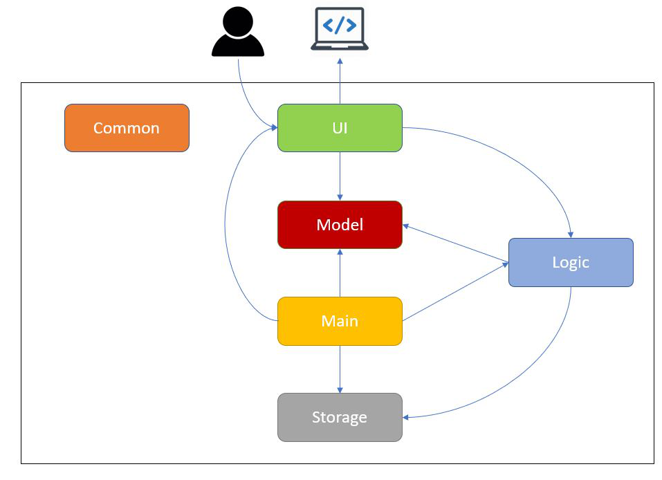
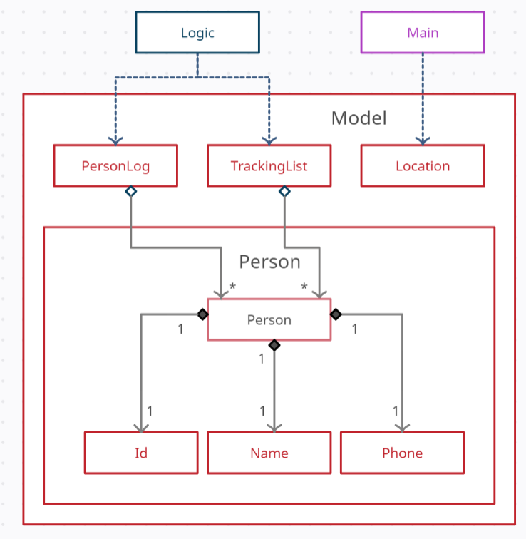

# Control Your Crowd - Developer Guide

* [Setting up](DeveloperGuide.md#setting-up)
* [Design](DeveloperGuide.md#design)
  * [Architecture](DeveloperGuide.md#architecture)
  * [UI component](DeveloperGuide.md#ui-component)
  * [Logic component](DeveloperGuide.md#logic-component)
  * [Model component](DeveloperGuide.md#model-component)
  * [Storage component](DeveloperGuide.md#storage-component)
  * [Common classes](DeveloperGuide.md#common-classes)
* [Implementation](DeveloperGuide.md#implementation)
* [Documentation](DeveloperGuide.md#documentation)
* [Testing](DeveloperGuide.md#testing)
* [Dev Ops](DeveloperGuide.md#dev-ops)
* [Appendix](DeveloperGuide.md#appendix)
  * [Appendix A: Product Scope](DeveloperGuide.md#appendix-a-product-scope)
    * [Target user profile](DeveloperGuide.md#target-user-profile)
    * [Value proposition](DeveloperGuide.md#value-proposition)
  * [Appendix B: User Stories](DeveloperGuide.md#appendix-b-user-stories)
  * [Appendix C: Use Cases](DeveloperGuide.md#appendix-c-use-cases)
  * [Appendix D: Non Functional Requirements](DeveloperGuide.md#appendix-d-non-functional-requirements)
  * [Appendix E: Glossary](DeveloperGuide.md#appendix-e-glossary)
  * [Appendix F: Instructions for Manual Testing](DeveloperGuide.md#appendix-f-instructions-for-manual-testing)
    * [Launch and Shutdown](DeveloperGuide.md#launch-and-shutdown)
    * [Clearing the list](DeveloperGuide.md#clearing-the-list)
    * [Saving data](DeveloperGuide.md#saving-data)

## Setting up

## Design

### Architecture

*Figure #. Architecture Diagram*

The ***Architecture Diagram*** shown above explains the high-level design of Control Your Crowd (CYC) application.
Below is a quick overview of each component.

`Main` is a class that is critical to starting the application proper, as well as exiting it:
* At app launch: Retrieves memory and saved log files (If available), initializes components in correct sequence, 
and connects them with each other.
  
* At shut down: It saves the log file to storage, and shuts down all components.

`Common` consists of a class of messages used by multiple components.
* `Messages` consists of a list of messages that will be displayed to the users, for various reasons such as error handling
and user notification.

The rest of Control-Your-Crowd (CYC) consist of four components.
* `UI`: The user interface of the application, and the entry point from the user.

* `Logic`: The command executor for CYC.

* `Model` : Holds the in-App data, such as the details of the user, and their checked-in/checked-out status.

* `Storage`: Reads and writes data from the hard disk to CYC.

### UI component

The UI consists of `TextUi` class. It acts as a middleware between users' input
and `Parser` class under **Logic Component**.

The `UI` component,

* Reads user commands using `Scanner` class.
* Pass raw user commands into `Parser` class under **Logic Component**.
* After the **Logic Component** has executed the function, it will then return `CommandOutput` object
  which contains the outcome of the execution, fail or succeed.

### Logic component

*Figure #. Structure of the Logic Component*

**API** : [`seedu.cyc.logic`](https://github.com/AY2021S2-CS2113T-T09-1/tp/tree/master/src/main/java/seedu/cyc/logic) package (*TO BE CREATED LATER*)

The Logic component,
1. Uses the `Parser` class to parse the user input obtained by the `TextUi` class of `UI`.
2. This results in a specific `Command` object to be returned from the `Parser` class.
3. Depending on the type of the `Command` object, its corresponding command execution will be called by `Main` of `UI`.
4. Some command execution affects the data in `Model` (e.g. clearing the list). 
5. The result of the command execution is encapsulated as a `CommandOutput` object which is passed back to the `TextUi`.
6. In addition, the `CommandOutput` object can also instruct the `TextUi` to perform certain actions, such as displaying the list to the user.

Given below is the Sequence Diagram for interactions within the `Logic` component for the `parseCommand("clear)"` API call.

*Figure #. Interactions Inside the Logic Component for the `clear` Command*

### Model component

**API** : [`seedu.cyc.person`](https://github.com/AY2021S2-CS2113T-T09-1/tp/tree/master/src/main/java/seedu/cyc/person) package

*Figure #. Structure of the Model Component*

The Model component,

* contains a `Person` class which represents a person who checks in/out.
* contains a `TrackingList` class which uses an ArrayList to keep track of all the `Person` objects who have currently checked in/out.
* contains a `PersonLog` class which uses a HashMap to permanently store all the `Person` objects who have checked in before.

A `Person` object contains:
* an `Id` object
* a `Name` object
* a `Phone` object

### Storage component
**API** : [`seedu.cyc.storage`](https://github.com/AY2021S2-CS2113T-T09-1/tp/tree/master/src/main/java/seedu/cyc/storage) package

The `Storage` component,
* saves and encodes `Person` objects in `Tracking List` into a `.txt` file.
* reads a `.txt` file of valid encoding and populates a `TrackingList`
* records a log of all historical states of `TrackingList`
* keeps a list of user setting in a `Config.properties` file which is read on launch
* defaults to `TrackingList.txt` but can be saved at a custom specified location
* loads on program startup automatically saves after each command

The storage module uses the `StorageFile` class to store the `TrackingList` class from Model. 
`StorageFile` achieves this by using two helper classes, `TrackingListEncoder` and `TrackingListDecoder`.

`TrackingListEncoder` takes the currently stored `TrackingList` and converts it to a more storage friendly String.
This String is then written to a file on the disk, known on the diagram as `StoredTrackingList`.
As the name suggests, `TrackingListDecoder` achieves the reverse by taking the file on drive, `StoredTrackingList`,
and interprets the file to be loaded into the memory as a `TrackingList`.

`StoredTrackingList` is the `.txt` file stored in the same directory as the program.
The location is determined by the `ConfigFile` class. 

`LogFile` takes the `TrackingList` every time the storage is updated
and packages it into `json` formatted string.
`LogFile` communicates with the disk by calling the methods
`loadLogFile` and `saveLogFile` in the `StorageFile` class.

The program settings for the user is manged by the `ConfigFile` class. 
Another file, `settingsFile` is read by `ConfigFile` when the program is started, 
to load the settings into the program memory. 
When a change is made by the user, `ConfigFile` will update the `settingsFile` through a save function.

### Common classes

Classes used by multiple components are in the `seedu.cyc.commons` package. 

## Implementation

## Documentation

## Testing

## Dev Ops

## Appendix

### Appendix A: Product scope
[WIP]

#### Target user profile
* User that requires more control over crowd level management in a building.
* Can type fast
* Prefers a simple desktop application over the more complicated systems
* Is reasonably comfortable with CLI apps
* Requires real time monitoring and tracking capability of people in the building
* Wants a cheaper alternative to crowd tracking systems

{Describe the target user profile}

#### Value proposition

A fast and versatile software solution that enables mall management to crowd control 
in the most efficient way possible.

### Appendix B: User Stories 
[WIP]

|Priority| As a ... | I want to ... | So that I can ...|
|--------|----------|---------------|------------------|
|*****|mall staff|be able to review the personal particulars of the customer|be aware of who he is|
|*****|new user|be able to use the program without much training| use the program as soon as possible and easily implement it|
|****|mall staff|key in personal particulars easily into the application| check in visitors quickly without holding up a line of customers|
|****|mall staff|be able to easily key in a unique personal identifier| check in and find a visitor|

### Appendix C: Use Cases

### Appendix D: Non-Functional Requirements

[WIP]

1. The program works on all major modern operating systems (Windows, macOS, Linux) without any effort by the user.

2. The program should boot up in less than 15 seconds. 

3. A user with above average typing speed for regular English text (not code or system admin commands) should be
able to accomplish most of the tasks faster using commands using just the keyboard.
   
4. Check in and check out for each visitor should take less than 5 seconds. 

### Appendix E: Glossary 
[WIP]

* *glossary item* - Definition

### Appendix F: Instructions for manual testing 
[WIP]

{Give instructions on how to do a manual product testing e.g., how to load sample data to be used for testing}
#### Launch and Shutdown
#### Clearing the list
#### Saving data
