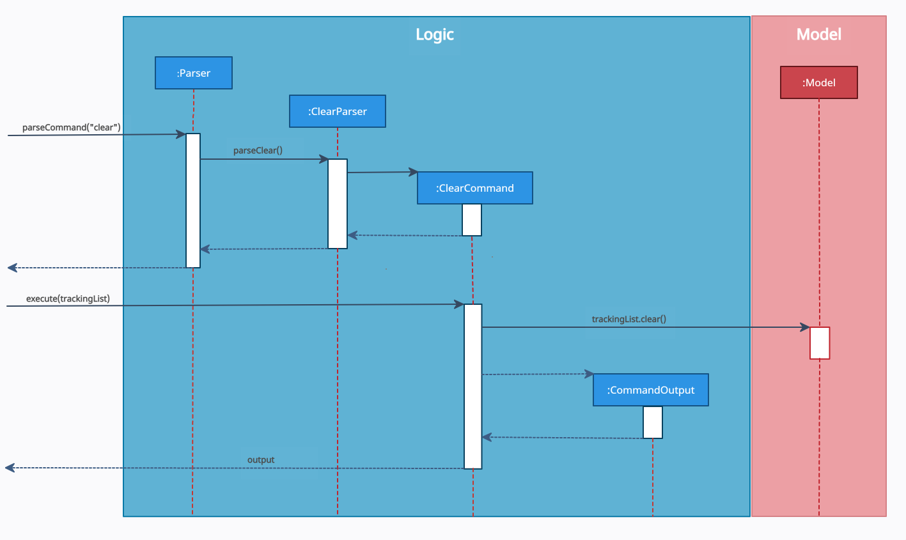

# Control Your Crowd - Developer Guide

1. [Setting up]()
2. [Design]()
   1. [Architecture]()
   2. [UI component]()
   3. [Logic component]()
   4. [Model component]()
   5. [Storage component]()
   6. [Common classes]()
3. [Implementation]()
4. [Documentation]()
5. [Testing]()
6. [Dev Ops]()
7. [Appendix]()
   1. [Appendix A: Product Scope]()
   2. [Appendix B: User Stories]()
   3. [Appendix C: Use Cases]()
   4. [Appendix D: Non Functional Requirements]()
   5. [Appendix E: Glossary]()
   6. [Appendix F: Product Survey]()
   7. [Appendix G: Instructions for Manual Testing]()
      1. [Launch and Shutdown]()
      2. [Clearing the list]()
      3. [Saving data]()

## Design & implementation

{Describe the design and implementation of the product. Use UML diagrams and short code snippets where applicable.}

### UI component

The UI consists of `TextUi` class. It acts as a middleware between users' input
and `Parser` class under **Logic Component**.

The `UI` component,

* Reads user commands using `Scanner` class.
* Pass raw user commands into `Parser` class under **Logic Component**.
* After the **Logic Component** has executed the function, it will then return `CommandOutput` object
  which contains the outcome of the execution, fail or succeed.

### Logic component

**API** : [`seedu.duke.logic`](https://github.com/AY2021S2-CS2113T-T09-1/tp/tree/master/src/main/java/seedu/duke/logic) package (*TO BE CREATED LATER*)

The Logic component,
1. uses the `Parser` class to parse the user input obtained by the `TextUi` class of `UI`.
2. This results in a specific `Command` object to be returned from the `Parser` class.
3. Depending on the type of the `Command` object, its corresponding command execution will be called by `Duke` of `UI`.
4. The command execution can affect the `Model` (e.g. check in a new visitor). 
5. The result of the command execution is encapsulated as a `CommandOutput` object which is passed back to the `TextUi`.
6. In addition, the `CommandOutput` object can also instruct the `TextUi` to perform certain actions, such as displaying the list to the user.

Given below is the Sequence Diagram for interactions within the `Logic` component for the `parseCommand("checkout i/123A)"` API call.

*Figure #. Interactions Inside the Logic Component for the `checkout i/123A` Command*

### Model component

**API** : [`seedu.duke.person`](https://github.com/AY2021S2-CS2113T-T09-1/tp/tree/master/src/main/java/seedu/duke/person) package

The Model component,

* contains a `TrackingList` class to keep track of all the `Person` objects.
* contains a `Person` class which represents a person who checks in or out.

A `Person` object contains:
* an `Id` object
* a `Name` object
* a `Phone` object

### Storage component
**API** : [`seedu.duke.storage`](https://github.com/AY2021S2-CS2113T-T09-1/tp/tree/master/src/main/java/seedu/duke/storage) package

The `Storage` component,
* saves and encodes `Person` objects in `Tracking List` into a `.txt` file.
* reads a `.txt` file of valid encoding and populates a `TrackingList`
* keeps a list of user setting in a `Config.properties` file which is read on launch
* defaults to `TrackingList.txt` but can be saved at a custom specified location
* loads on program startup automatically saves after each command

The storage module uses the `StorageFile` class to store the `TrackingList` class from Model. 
`StorageFile` achieves this by using two helper classes, `TrackingListEncoder` and `TrackingListDecoder`.

`TrackingListEncoder` takes the currently stored `TrackingList` and converts it to a more storage friendly String.
This String is then written to a file on the disk, known on the diagram as `StoredTrackingList`.
As the name suggests, `TrackingListDecoder` achieves the reverse by taking the file on drive, `StoredTrackingList`,
and interprets the file to be loaded into the memory as a `TrackingList`.

`StoredTrackingList` is the `.txt` file stored in the same directory as the program.
The location is determined by the `ConfigFile` class. 

The program settings for the user is manged by the `ConfigFile` class. 
Another file, `settingsFile` is read by `ConfigFile` when the program is started, 
to load the settings into the program memory. 
When a change is made by the user, `ConfigFile` will update the `settingsFile` through a save function.

### Common classes

Classes used by multiple components are in the `seedu.Duke.commons` package. 

## Product scope [WIP]
### Target user profile
* User that requires more control over crowd level management in a building.
* Can type fast
* Prefers a simple desktop application over the more complicated systems
* Is reasonably comfortable with CLI apps
* Requires real time monitoring and tracking capability of people in the building
* Wants a cheaper alternative to crowd tracking systems

{Describe the target user profile}

### Value proposition

A fast and versatile software solution that enables mall management to crowd control 
in the most efficient way possible.

## User Stories [WIP]

|Priority| As a ... | I want to ... | So that I can ...|
|--------|----------|---------------|------------------|
|*****|mall staff|be able to review the personal particulars of the customer|be aware of who he is|
|*****|new user|be able to use the program without much training| use the program as soon as possible and easily implement it|
|****|mall staff|key in personal particulars easily into the application| check in visitors quickly without holding up a line of customers|
|****|mall staff|be able to easily key in a unique personal identifier| check in and find a visitor|

## Non-Functional Requirements [WIP]

The program works on all major modern operating systems (Windows, macOS, Linux) without any effort by the user.

## Glossary [WIP]

* *glossary item* - Definition

## Instructions for manual testing [WIP]

{Give instructions on how to do a manual product testing e.g., how to load sample data to be used for testing}
