# User Guide for Control Your Crowd (CYC)

* [1. Introduction](UserGuide.md#introduction)
* [2. Quick Start](UserGuide.md#quick-start)
* [3. Features](UserGuide.md#features)
    * [3.1 Viewing help](UserGuide.md#viewing-help-help): `help`
    * [3.2 Check-in a person](UserGuide.md#check-in-a-person-checkin): `checkin`
    * [3.3 Listing all persons](UserGuide.md#listing-all-persons-listall): `listall`
    * [3.4 Listing checked-in persons only](UserGuide.md#listing-checked-in-persons-only-list): `list`
    * [3.5 Finding a person by ID](UserGuide.md#finding-a-person-by-id-number-find): `find`
    * [3.6 Checkout a person](UserGuide.md#check-out-a-person-checkout): `checkout`
    * [3.7 Clearing all entries](UserGuide.md#clearing-all-entries-clear): `clear`
    * [3.8 Edit venue capacity](UserGuide.md#edit-venue-capacity-editmax): `editmax`
    * [3.9 Move Storage](UserGuide.md#change-storage-location-movestorage): `movestorage`
    * [3.10 Exiting the program](UserGuide.md#exiting-cyc-exit): `exit`
    * [3.11 Visitor Log](UserGuide.md#visitor-log)
    * [3.12 Auto Save](UserGuide.md#auto-save)
    * [3.13 Changing save location](UserGuide.md#changing-save-location)
    * [3.14 History](UserGuide.md#history)
* [4. FAQ](UserGuide.md#faq)
* [5. Command summary](UserGuide.md#command-summary)

## 1. Introduction

Welcome to the User Guide of **Control Your Crowd**!

Our application, Control Your Crowd (CYC), will allow you to manage your crowds in real-time. It allows efficient 
tracking and accessing of visitors' profiles. You can also easily check-in and check out a visitor, get the current 
crowd level, limit the venue capacity, save the visitor log for future references, and much more! 
CYC is an all-in-one application to help event management team, event organizers for events such as Ultra Music
Festival manage crowd level with ease. It also works very well for small enterprises and mall management team that
needs to monitor influx of visitors. 

The application uses a Command Line Interface (CLI); this means that you operate the 
application by typing commands into a command window. With simple and easy-to-use commands, 
CYC provides you with efficient crowd management which is faster than traditional 
Graphical User Interface (GUI) applications can offer. GUI applications 
allow the user to interact with the application through graphical icons such as buttons and clickable.

Jump to [Quick Start](UserGuide.md#quick-start) to learn how to manage your crowd efficiently
with CYC.

##2. Quick Start

> Prerequisites:
> * Ensure that you have **Java 11** or above installed in your Computer. If you do not have, you can get it from
>   [here](https://www.oracle.com/sg/java/technologies/javase-jdk11-downloads.html).

1. Download the latest version of `CYC.jar` from [here](https://github.com/AY2021S2-CS2113T-T09-1/tp/releases).
2. Copy the file to the folder you want to use as the home folder for your CYC.
3. Open up a command window to the location where your `CYC.jar` is located.
4. Run the command `java -jar CYC.jar [VENUE_MAXIMUM_CAPACITY]`. For example, 
   `java -jar CYC.jar 500`.
   * Ensure that the `VENUE_MAXIMUM_CAPACITY` entered is a positive integer that does not exceed 6 digits.
     * You can enter input the `VENUE_MAXIMUM_CAPACITY` with or without quotations. 
       For example, `500` and `"500"` will both work.
   * When you are running the `CYC.jar` again, ensure that the `[venue maximum capacity]` is more than the current
     number of visitors checked in. Failure to do so will lead to negative maximum venue capacity.     
5. If the setup is correct, you should see CYC being loaded as shown below (note: your version of CYC would be the 
   latest version).
   
   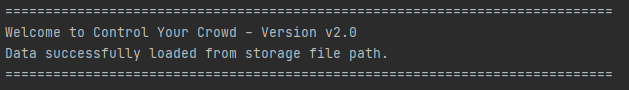
   
6. Input the command in the command window and press Enter to execute it. Refer to [Features](UserGuide.md#features)
   for details of each command.
   
> Tips and Additional Notes: 
> * Maximize the command line window to ensure that you get to make use of the visuals of CYC CLI.
> * Do **NOT** edit the `LogFile.txt`, `TrackingList.txt` or `History.txt` files.
>   * You are only allowed to copy the contents of the `History.txt` file.

##3.  Features 

> Notes about the command format:
> * Commands are in `lower_case`.
> * Items in square brackets `[ ]` are optional.
> * Words in `UPPER_CASE` are the parameters to be supplied by user.
>    * E.g. in `checkin n/NAME i/LAST_4_CHARS_OF_ID`, `NAME` is a parameter that has to be supplied by user. So e.g. `checkin n/John i/123A`.
> * Additional parameters for commands that do not take in parameters (such as `help`, `list`, `exit`, `clear`) will be ignored.
>   * e.g. if the user types `help 123`, it will be interpreted as `help`.
> * `i/LAST_4_CHARS_OF_ID` is unique. (i.e. no two persons will have the same ID)

###3.1 Viewing help: `help`

This command will provide you a summary of the all the commands with its corresponding format.
This command will help you in situations when you forget the available commands, or their format while on duty.

#### Format: `help`

#### Example Input: `help`

#### Example Output:

###3.2 Check-in a person: `checkin`

Supposed there is a visitor,
you can check in a person to CYC via `checkin` command. After a successful check-in, CYC will also notify you on the
current venue capacity.

#### Format: 
`checkin i/LAST_4_CHARS_OF_ID n/NAME [p/PHONE_NUMBER]`
* First 3 characters of `LAST_4_CHARS_OF_ID` should be integers.  Last character of `LAST_4_CHARS_OF_ID` must be in `CAPS`.
* `NAME` is optional. If the user has checked in before, entering the `LAST_4_CHARS_OF_ID` is sufficient to retrieve the user's `NAME` and `PHONE_NUMBER` 
  from previous check in. **If the user has not checked in before, `NAME` must be entered.**
* `NAME` must only contain english alphabet letters and empty spaces with a maximum character limit of 30. Any other characters will not be accepted.
* `PHONE_NUMBER` is optional. `PHONE_NUMBER` must consist of 8 integers, as per local (Singapore) phone number format.

Supposedly John is a new visitor and he wants to check in. Since it is his first time visiting, you should check in John using his
`i/LAST_4_CHARS_OF_ID`, `n/NAME` and `[p/PHONE_NUMBER]` as shown below.
#### Example Input:

`checkin i/123A n/John p/91231112`

When John visits again in the future, you would only need to check in 
using his `i/LAST_4_CHARS_OF_ID` as shown below.

`checkin i/123A`

#### Example Output:
For both new visitor and returning visitor, you should observe the following output.

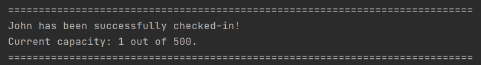

However, you should expect the following output when the maximum capacity is reached.

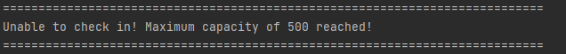

> Additional Note:
> * If you attempt to check in a visitor who has already checked in, CYC will display the success message.
>   * If you want to find out if a particular visitor has been checked in, you can use `find i/LAST_4_CHARS_OF_ID`.
>     You can click [here](UserGuide.md#finding-a-person-by-id-number-find) to learn more about that command.
 
###3.3 Listing all persons: listall

Supposed you want to find out all the visitors that had entered the venue,
it can be done with `listall`. This command shows a list of all persons
who have checked-in and checked out. The ID and phone numbers are also 
shown in case you need to contact any of these visitors. However,
if the visitor's phone number has not been registered with CYC, it will
be shown as `--`.

Format: `listall`

Example Input: `listall`

Example Output:

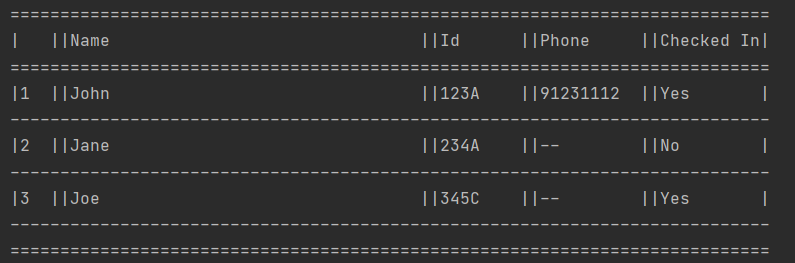

###3.4 Listing checked-in persons only: `list`

`list` command is similar to `listall`, the only difference is that `list` only
returns the list of visitors that are still in the venue or have not check out.
Shows a list of all persons with their details currently checked in. It also shows the number of people 
remaining to reach the maximum capacity for that venue.

#### Format: `list`

#### Example Input: `list`

#### Example Output:

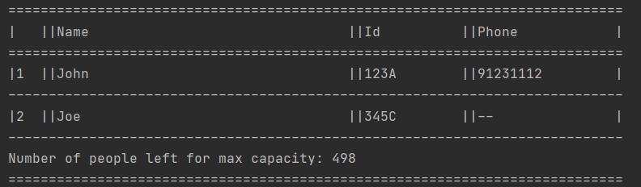

###3.5 Finding a person by ID number: `find`

You can use `find` command if you need to check whether a particular visitor
is still in the venue or check for his/her particulars.
Given the person's last 4 characters of ID, we can find the details of the person and status (Checked in, or checked out)

#### Format: `find i/LAST_4_CHARS_OF_ID`

* First 3 characters of `LAST_4_CHARS_OF_ID` should be integers.  Last character of `LAST_4_CHARS_OF_ID` must be in `CAPS`.
    
#### Example input: `find i/123A`

#### Example Output:

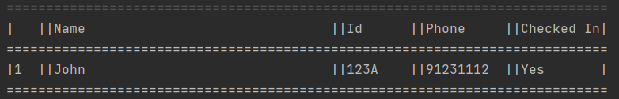

###3.6 Check out a person: `checkout`

You can check out a visitor from CYC, when he/she is leaving from the venue via
`checkout` command. By doing so, you will be removing the visitor from checked in
list in CYC. However, person's particulars will be retained for a faster 
check in the following visit.

#### Format: `checkout [n/NAME] i/LAST_4_CHARS_OF_ID`
* First 3 characters of `LAST_4_CHARS_OF_ID` should be integers.  Last character of `LAST_4_CHARS_OF_ID` must be in `CAPS`.
* `NAME` is optional. `NAME` must be a string. Integers will not be accepted.

#### Example input: `checkout n/John i/123A`

#### Example output:

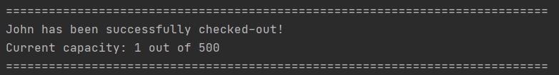

###3.7 Clearing all entries: `clear`

`clear` command clears all entries stored by the program. It could be useful
to clear CYC data at the end of the day, or when required. However, this is 
not recommended as you will lose track of the visitors who have not check out.
Therefore, use `clear` command with caution.

#### Format: `clear`

#### Example Input: `clear`

#### Example Output:

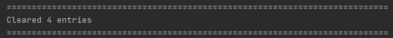

###3.8 Edit venue capacity: `editmax`

In the event that requires the venue capacity to change, you 
can update the new venue capacity in CYC using `editmax` command.
Edits the max capacity of the venue.

#### Format: `editmax NEW_CAPACITY`
* `NEW_CAPACITY` must be a positive integer and not more than six digits.
* The program crashes if you do not provide `NEW_CAPACITY`.
    * This bug will be fixed in the next release.

#### Example Input: `editmax 150`

#### Example Output:

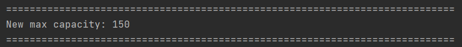

###3.9 Change storage location: `movestorage`

This command allows you to move the location of the saved file, if you desire a different location 
from the default setting. A suggested use would be to use it to backup files.

> Additional Notes:
> * The path specified has to be unused.
> * The path specified will have `.txt` to the end of it.
> * The previous location will be deleted by the program.

#### Format: `movestorage NEW_DESTINATION`

#### Example Input: `movestorage /new/test`

#### Example Output:

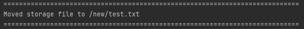

###3.10 Exiting CYC: `exit`

`exit` command will save the current state of CYC before exiting the programme. 

#### Format: `exit`

#### Example Input: `exit`

#### Example Output: 

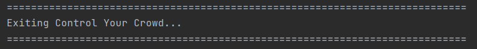

###3.11 Visitor Log

CYC automatically saves the details of previous persons therefore providing the users with a
convenient location to retrieve all particulars and details of visitors. 

With Visitor log,
a person who have checked in before, does not have to input all his details 
again when using the `checkin` command.

The person details are stored in `/LogFile.txt` in the same folder as the program.
You can reset Visitor Log by exiting CYC and deleting it before reboot. 

###3.12 Auto Save
The program automatically saves data to a `.txt` file after each command you input.
The program defaults to saving to `/TrackingList.txt` in the same folder as the program.
As such, you do not have to worry about saving the data or memory loss in case of
programme crash. 

###3.13 Changing save location
To change the save location, you can use the command `movestorage`. The command format for move storage
is stated above. 

If the user deletes the folder of the new path, the program may run into write errors.
To resolve the issue, `settings.properties` should be deleted to reset the program state.

###3.14 History

CYC automatically keeps a back up of the checkin and checkout history in `history.txt` file after
each check in and check out operation.

Users, such as event organiser or mall owners, could therefore study these data for future planning and necessary
upgrade of facilities. History data is also stored in CSV format, comma separated values such that it can be 
extracted and cleaned to use for automatic data analytics.

### Saving history
The program automatically saves the history to 'history.txt' file after each checkin and checkout operation.

### Clearing history

In the unlikely event that, your machine runs out of storage space or you want to reset
the history. You can follow these steps, to clear history.

To clear history, please follow the following steps:
1. Exit CYC.
2. Locate the directory of CYC on the computer.
3. Locate `/History.txt` and delete the file directly. 
   (CYC will create a new History file upon a restart.)

##4. FAQ

**Q**: How do I transfer my data to another computer? 

**A**: Please follow these steps:
1. Follow the [Quick Start](UserGuide.md#quick-start) guide and install CYC on the computer
2. Transfer the `/History.txt`,`/LogFile.txt` and `/TrackingList.txt` to the target computer's main CYC folder.
3. Start CYC and it will automatically load the data.

**Q**: What does `Clear` command clears exactly?

**A**: `Clear` command only clears the visitors that are checked in. However, it does not clear the person log. Which
means if you had checked in a person with name: John, Id: 123A. After executing `clear` command, CYC will not allow you
to check in another person with name: James, Id: 123A as CYC will detect that the Id is a duplicate despite its two 
different people.

##5. Command Summary

Action | Format | Examples
--- | --- | ---
Help | `help` | `help`
Check-in a person | `checkin i/LAST_4_CHARS_OF_ID n/NAME [p/PHONE_NUMBER]` | `checkin  i/123A n/John p/91231112`
List all person | `listall` | `listall`
List checked-in persons only | `listcheckedin` | `listcheckedin`
Find person by ID | `find i/LAST_4_CHARS_OF_ID` | `find i/123A`
Checkout a person | `checkout i/LAST_4_CHARS_OF_ID` | `checkout n/John i/123A`
Clear all entries | `clear` | `clear`
Edit venue capacity | `editmax NEW_CAPACITY` | `editmax 100`
Move storage | `movestorage PATH` | `movestorage data/storage`
Exit | `exit` | `exit`

